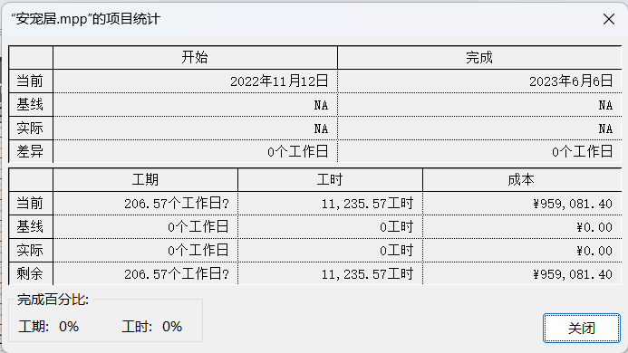
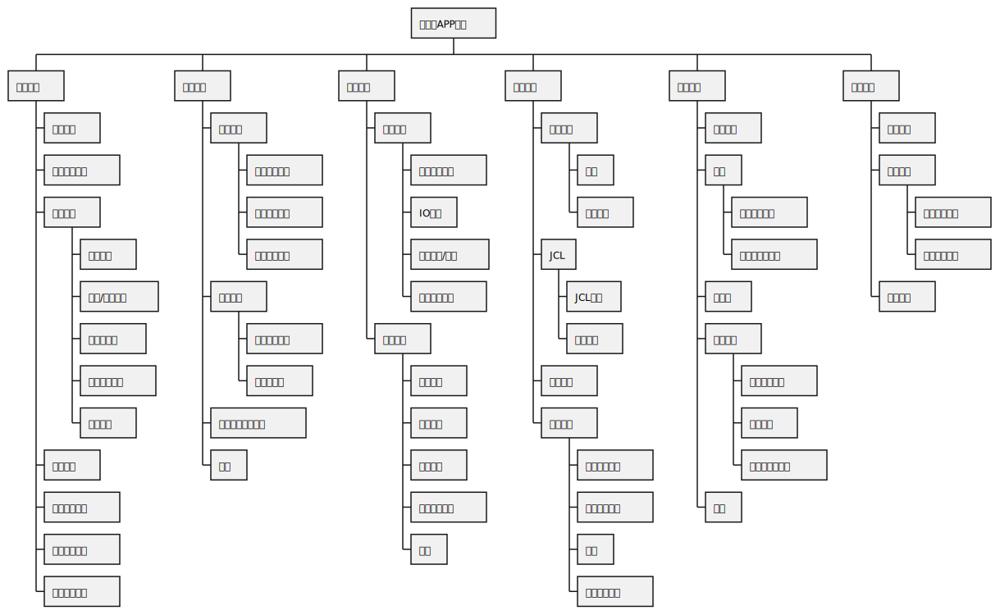
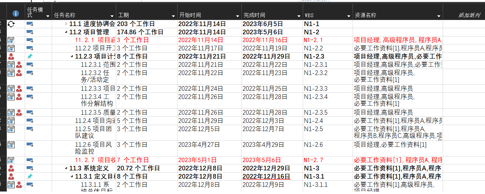
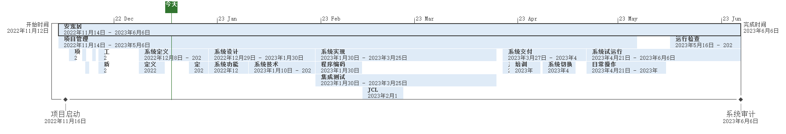
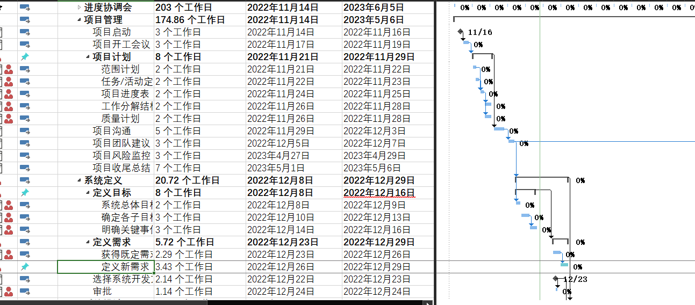
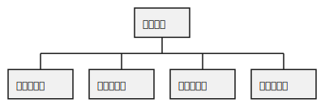
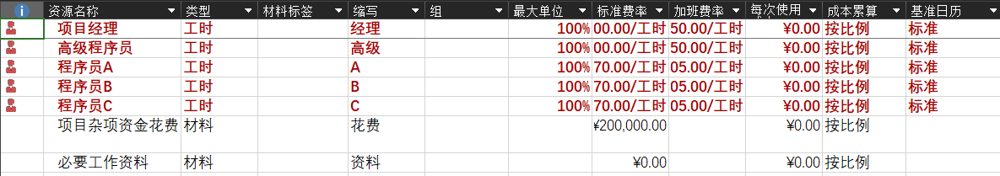

# 安宠居项目总结
——2020024组项目管理汇报

汇报人：
 
 

> 2022年11月4日-2023年5月1日

## 1、项目简介
（主要介绍项目内容，谁提出，解决什么问题，达到什么效果）

### 介绍/背景
- 一款解决部分宠物的待领养问题，和不同阶段养宠者的各种需求与问题的软件。
- 宠物渐渐成为了越来越多年轻人的精神陪伴，成为了人们生活中不可或缺的一部分。
- 相比于其他APP，该APP专注于打造一个市面上暂时没有的养宠者互助交流平台。
- 该APP主要有三大核心功能，分别为待领养宠物信息发布，用户养宠日常及经验分享，以及官方提供的养宠解疑功能。

### 业务目标
- 该项目能有效地改善和解决改善宠物遗弃及流浪宠物问题。
- 让人们在遇到流浪猫狗时能因有平台寻求帮助而更愿意主动向这些宠物提供帮助。
- 同时，该APP鼓励养宠者在上面发布自己的养宠日常与经验，也有官方提供的各种养宠知识来帮助新手养宠者能解决养宠后的种种问题而不至于因怕麻烦而放弃领养宠物。
- 该项目的意义旨在在国内创建一个良好的养宠环境，让人们拥有良好的养宠常识与基本道德。
- 帮助解决社会上的流浪动物问题，建设更美好的城市环境，让天下不再有流浪的宠物。
- 同时也能在一定程度上阻断部分疾病的传播。

## 2、项目启动
（介绍项目起止时间、项目计划书制定、用project设置项目基本信息、工作日历等）

 
 

> 项目时间：2022年11月4日-2023年5月1日

---
项目基本信息

## 3、项目计划
- 项目范围管理
- 项目时间管理
- 项目成本管理
- 人力资源管理

### 3.1 项目范围管理
分解项目工作，完成WBS、配合介绍在project中是如何完成的

---
项目需求矩阵
| 需求序号 | 需求标题     | 需求名称                             | 类别 | 需求描述                                     | 需求状态 | 优先级 | 优先级说明             |
| -------- | ------------ | ------------------------------------ | ---- | -------------------------------------------- | -------- | ------ | ---------------------- |
| 1        | 用户管理     | -                                    | -    | -                                            | -        |
| 1.1.1    | -            | 添加用户                             | 原始 | 添加用户，包含添加单个和批量添加             | 已批准   | 高     | 是用户的功能执行必须的 |
| 1.1.2    | -            | 删除用户                             | 原始 | 删除用户，包含单个和批量删除                 | 已批准   | 高     | 关键功能，必须实现     |
| 1.1.3    | -            | 修改用户使用权限                     | 原始 | 修改用户使用权限                             | 已批准   | 高     | 关键功能，必须实现     |
| 1.2      | -            | 修改自己密码                         | 原始 | 修改自己密码                                 | 已批准   | 高     | 关键功能，必须实现     |
| 1.3      | -            | 登录                                 | 原始 | 登录系统                                     | 已批准   | 高     | 关键功能，必须实现     |
| 1.4      | -            | 退出登录                             | 原始 | 退出登录                                     | 已批准   | 高     | 关键功能，必须实现     |
| 2        | 用户功能管理 | -                                    | -    | -                                            | -        | -      | -                      |
| 2.1.1    | -            | 发布与删除流浪动物待领养帖子         | 原始 | 用户在平台上发布待领养流浪动物帖并能删除     | 已批准   | 高     | 关键功能，必须实现     |
| 2.1.2    | -            | 发布与删除养宠经验帖                 | 原始 | 用户在平台上发布自己的养宠经验交流帖并能删除 | 已批准   | 高     | 关键功能，必须实现     |
| 2.1.3    | -            | 查看别人发布的领养帖                 | 原始 | 用户在平台上浏览别人的待领养帖子             | 已批准   | 高     | 关键功能，必须实现     |
| 2.1.4    | -            | 查看别人发布的宠物经验贴，能予以评论 | 原始 | 用户在平台上交流别人的经验帖                 | 已批准   | 高     | 关键功能，必须实现     |
| 2.2      | -            | 用户间私信功能                       | 原始 | 用户与用户间建立私信功能                     | 已批准   | 高     | 关键功能，必须实现     |
| 3        | 功能管理     | -                                    | -    | -                                            | -        | -      | -                      |
| 3.1      | -            | 官方提供各种类宠物的养宠知识学习平台 | 原始 | 应用内建立养宠知识学习平台                   | 已批准   | 中     | 关键功能               |
| 3.2      | -            | 建立养宠用品商城                     | 原始 | 应用内建立养宠用品商城                       | 已批准   | 高     | 关键功能，必须实现     |
| 3.3      | -            | 建立养宠解疑平台                     | 原始 | 应用内建立养宠解疑平台                       | 已批准   | 高     | 关键功能，必须实现     |

---
工作分解结构

---
Project实现

---
项目进度要求

---
项目活动排序

---
设置任务类型

### 3.2 项目时间管理
介绍项目进度要求，项目活动的排序，建立里程碑任务，用project调整活动顺序，设置FS、SS、FF、SF类型的任务等

### 3.3 项目成本管理
项目费用的估算、project中成本的设置、超成本预算的处理

### 3.4 人力资源管理
主要介绍团队的组建、人员的分工和职责，在project中设置标准费率和加班费率

---

| 角色     | 姓名   | 组织/位置         | 联系信息          |
| -------- | ------ | ----------------- | ----------------- |
| 项目经理 | 庞晓宇 | 软件学院/软件工程 | 2581011320@qq.com |
| 需求人员 | 李小刚 | 软件学院/软件工程 | 1097420889@qq.com |
| 设计人员 | 李晨阳 | 软件学院/软件工程 | 1346802467@qq.com |
| 开发人员 | 聂嵘康 | 软件学院/软件工程 | 1163556652@qq.com |
| 测试人员 | 陈罗星 | 软件学院/软件工程 | 3366438434@qq.com |

---
项目管理人员：
- 全面负责项目组织和规划 
- 全面负责项目计划制定和维护 
- 负责项目跟踪和管理 
- 负责项目资源的分配和协调 
- 负责组织和计划之间的协调 
- 配合需求分析同学做协调活动

需求分析人员：
- 负责与用户的协调工作 
- 负责用户的需求接口 
- 配合项目经理的资源协调活动 
- 负责系统的维护活动

---
软件开发人员：
- 全面负责项目的软件开发：设计、编码、测试及配置。 
- 负责产品质量的控制 
- 配合负责质量保证的同学工作，如文档编写、测试等 
- 配合产品验收活动 

质量保证人员：
- 全面负责项目过程及产品规范的制定 
- 负责过程的质量保证活动 
- 过程评审 
- 产品评审

---
标准费率和加班费率

## 4、项目执行
- 项目资源分配
- 计划实际对比
- 项目工序调整
- 项目时间调整
- 项目资源调整

### 4.1 项目资源分配
将资源分配给具体任务，在project中实现任务资源的分配、显示资源分配情况。

### 4.2 计划实际对比
用project对比计划和进度的执行情况，显示挣值分析表，分析项目执行情况。

### 4.3 项目工序调整
为缩短工期，模拟项目工期缩减一个月，用Project实现项目工序调整，缩短工资。

### 4.4 项目时间调整
假设程序员小张请假一周，需求分析的任务需要推迟一周开始，用project调整实现。

### 4.5 项目资源调整
用project调整项目中过度分配的资源，实现资源的均衡。

## 5、项目控制
- 项目任务控制
- 项目时间控制
- 项目资源控制

### 5.1 项目任务控制
对项目进行监控和跟踪，用project设置项目基线、中期计划，查看开始与完成时间差异、计划工时与完成工时之间的差异、跟踪项目成本和工时。

### 5.2 项目时间控制
对比项目进度和规划之间的差异，用project创建延迟任务报表、过渡分配资源报表、挣值报告表报、现金流量报表、关键任务表报，展示和分析项目进展。

### 5.3 项目资源控制
跟踪项目执行，用project查看项目的资源冲突情况，调整资源值，分析项目的任务成本、资源成本，显示关键路径。

## 6、项目收尾
- 项目中出现的问题和解决
- 团队成员工作感受分享
- 项目经理总结

### 6.1 项目出现的问题，如何解决的
- 缺乏适当的人员与技能：用人不当与资源分配失衡是在项目管理最常见的一种失误。一个项目能否圆满完成，人员与技能的配备占据主导因素。用人不当往往会导致项目无法继续执行。这样就算计划再好，也是纸上谈兵。
  - 处理：项目经理应全面了解及掌控技能与资源情况。包括对项目顾问、合约承包商和外包商的详细评估。使用项目管理工具可以帮助项目经理充分掌握所有团队成员的技能与工作量分配。在了解分工与职责后。项目经理就可以决定如何在日常工作和项目中合理分配资源。指派专门的资源经理来负责解决人员与资源的分配问题。

---
- 没有遵循标准的项目管理流程：缺乏合理的流程会抬高项目风险，放大项目失败的可能性，最终导致无法在限定的时间与预算内完成项目。
  - 处理：制定良好的项目管理流程能提高项目效率，并及时捕捉项目执行过程中的各种问题，控制风险，IT项目经理应事先建立可重复的流程来进行项目规划、资源分配与成员沟通，这样才能保障项目的回报与成效。
- 流程太多太杂：过多的流程会让项目失去灵活性，继而影响参与者的积极性。
   - 处理：与项目支持者及参与者积极沟通。
- 对不合理的项目期限不作反驳：使工作陷入无法如期完成项目的窘境。
  - 处理：IT项目经理应根据实际情况和项目参与者的意见对项目期限做出相对应的调整。

### 6.2 团队成员工作感受分享
> 庞晓宇：通过这次项目实践，学习了项目管理工具的使用，熟悉了项目管理工作的流程。了解了项目在管理过程中所需要注意的各个方面。

> 李小刚：

> 李晨阳：

> 聂嵘康：

> 陈罗星：

### 6.3 项目经理总结
通过这一次的项目实践，我深刻体会到作为项目管理者需要去学习有很多，第一次在很多方面还缺少经验。只有在掌握了丰富的理论知识，积累丰富的安装经验后，才能在实践工作中更得心应手。关于不足和需要完善的地方，将在以后的工作中努力学习，不断总结，扬长避短。
每个人的人生也如项目一样，是独一无二的；有些的人生也如项目创造出无与伦比的产品，但有些人生也会如那些戛然而止的项目，匆匆逝去。不妨将PMBOK的理念用于规划和管理人生，那么请问：人生的项目章程在哪里...？

# 谢谢大家
