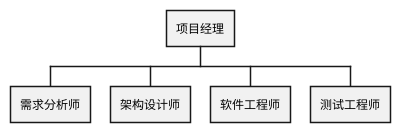
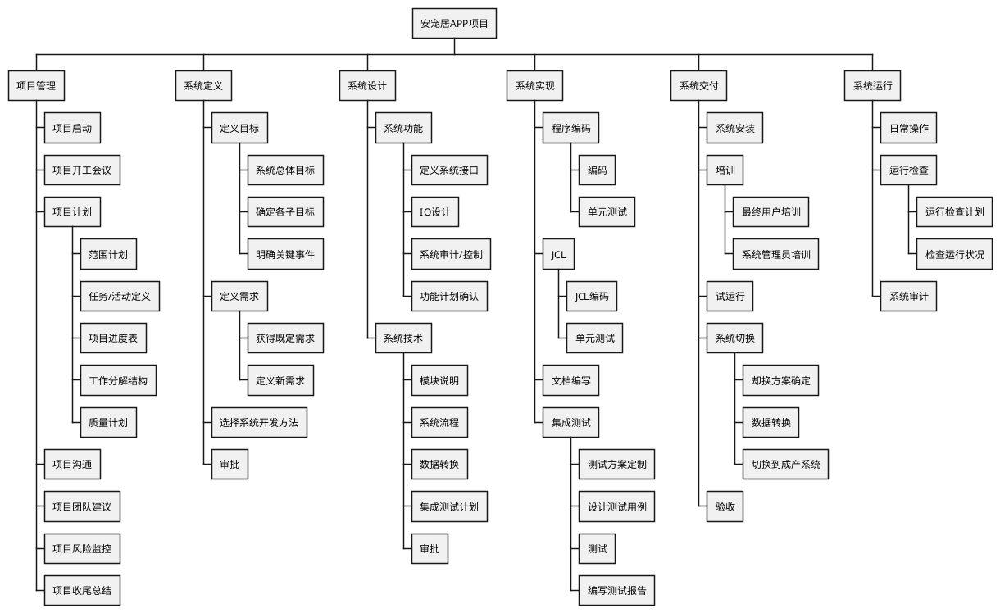

# 项目管理计划

> 编制人: 庞晓宇
> 日期：2022年11月12日

## Ⅰ 介绍

### 项目概述
一款解决部分宠物的待领养问题，和不同阶段养宠者的各种需求与问题的软件。
宠物渐渐成为了越来越多年轻人的精神陪伴，成为了人们生活中不可或缺的一部分。
相比于其他APP，该APP专注于打造一个市面上暂时没有的养宠者互助交流平台。
该APP主要有三大核心功能，分别为待领养宠物信息发布，用户养宠日常及经验分享，以及官方提供的养宠解疑功能。

### 项目可交付成果
1. 项目软件开发：开发一款符合需求、设计合理且美观易用的软件。
2. 可运营APP专属社交账号：拥有不小的知名度，领养互助功能的宣传小有成效。以此作宣传支点同时与各界合作打出品牌知名度，与社会爱心人士共同发起爱宠护宠活动。
3. 宠物疾病专属问询：邀请专业兽医为用户提供实时且廉价的宠物问询服务以解决宠物出现的急性症状而饲养者过于紧张而不了解如何解决的问题。
4. 线下实体店：提供宠物寄养、流浪动物保护，同时提供宠物医疗、食物售卖、以及供人娱乐。

### PMP的进化
<!-- 描述此计划将如何完成、传播和将其置于变更控制之下。描述如何处理计划和计划外更新 -->
- 尽快明确需求，确定开发模型，对项目组成员进行角色分工，一个项目经理，由项目经理指定开发经理和质量经理，然后进一步明确人员分工。
- 根据角色分工和相关的职责，编制项目的组织结构图。
- 制作工作分解结构（WBS）、范围说明书和甘特图，详细说明完成安宠居项目所需要的工作。
- 事前明确软件开发过程规范，包括需求过程、设计过程、编码过程、测试过程、提交过程，同时明确变更控制流程。
- 组织项目人员评审项目计划，必要时，修正计划，最后将计划存为基准计划。
- 项目经理按照计划组织项目组的人员实施计划，开发软件项目
- 项目进行过程中，项目经理及时收集项目时间、资源、范围等信息
- 根据收集的项目信息编制项目的性能报告
- 每周进行定期的项目评审，最后提交项目的评审报告
- 项目经理根据变更控制流程处理项目变更信息。

### 参考资料
- IT项目管理
- 项目管理知识体系指南 PMBOK指南

### 定义和缩略语
- ASD：自适应软件开发
- Scrum：一种完成复杂的、创新工作范围项目的敏捷开发方法。
- SDLC：系统开发生命周期
- PRINCE2：受控环境中的项目管理
- BSM：业务服务管理
- SWOT： 分析优势、劣势、机会和威胁，用来辅助战略计划。
- RTM：需求跟踪矩阵
- WBS：工作分解结构
- AOA：双代号网络图
- ADM：箭线图
- CPM：关键路径法
- PERT：计划评审
- TOC：约束理论
- AC：实际成本
- BAC：完工预算
- CPI：成本绩效指数
- CV：成本偏差
- EV：挣值
- EAC：完工估算
- PV：计划值
- RP：完工百分比
- SPI：进度执行指数
- SV：计划品茶

## Ⅱ 项目组织

### 流程模型
<!-- 指定要用于此项目的生命周期模型，或引用将遵循的组织标准模型。流程模型必须包含项目立项、产品开发、产品发布、项目终止的角色、活动、准入条件和退出标准。 -->
在研究和对比了六种开发模型后，团队准备选用敏捷开发模型。敏捷开发强调以人为核心，这点和原型化模型很像，但是更强调程序员团队和业务专家之间的紧密联系，频繁交付新的软件版本，紧凑的自我组织型团队，更注重软件开发中人的作用。

### 组织结构
<!-- 描述项目的内部管理结构，以及项目与组织其他部分的关系。建议使用图表来显示权限线。 -->

| 角色     | 姓名   | 组织/位置         | 联系信息          |
| -------- | ------ | ----------------- | ----------------- |
| 项目经理 | 庞晓宇 | 软件学院/软件工程 | 2581011320@qq.com |
| 需求人员 | 李小刚 | 软件学院/软件工程 | 1097420889@qq.com |
| 设计人员 | 李晨阳 | 软件学院/软件工程 | 1346802467@qq.com |
| 开发人员 | 聂嵘康 | 软件学院/软件工程 | 1163556652@qq.com |
| 测试人员 | 陈罗星 | 软件学院/软件工程 | 3366438434@qq.com |

### 组织边界和接口
<!-- 描述项目与其交互的主要实体之间的管理和管理接口。表可能是表示此信息的有用方法。 -->

#### 项目经理
项目经理负责人员安排和项目分工，保证按期完成任务，对项目的各个阶段进行验收，对项目参与人员的工作进行考核，管理项目开发过程中的各种文档，直接对公司领导层负责，他既能处理好与客户之间的关系，又能协调好项目小组成员之间的关系。项目经理是在整个项目开发过程中项目组内对所有非技术性重要事情做出最终决定的人。

#### 需求分析师
通俗一点讲需求分析师就是跟客户交流，准确获取客户需要。需求分析师是项目前期与客户方打交道最多的人，对于客户来说，他可以代表整个项目组，对与项目组成员来说他的意见可以代表客户方的意见，项目组内所有与客户需求相关的事情必需得到他的认可。

#### 架构师
主要负责设计项目中软件部分的体系结构和模型，排定软件开发日程，确定软件内部流程和框架等。系统架构师也可以理解成技术总监。系统架构师是在部门内所有软件项目中，对技术上所有重要的事情做出决定的人。

#### 软件开发工程师
根据设计师的设计成果进行具体编码工作，对自己的代码进行基本的单元测试。软件工程师是最终实现代码的成员。美工:负责公司软件产品的美工设计和网页制作需求调研员:与客户交流了解客户的需求。

#### 软件测试工程师
理解产品的功能要求，并对其进行测试，检查软件有没有缺陷，测试软件是否具有稳定性、安全性、易操作性等性能，写出相应的测试规范和测试用例的专门工作人员。

### 项目责任
该项目能有效地改善和解决改善宠物遗弃及流浪宠物问题。
让人们在遇到流浪猫狗时能因有平台寻求帮助而更愿意主动向这些宠物提供帮助。
同时，该APP鼓励养宠者在上面发布自己的养宠日常与经验，也有官方提供的各种养宠知识来帮助新手养宠者能解决养宠后的种种问题而不至于因怕麻烦而放弃领养宠物。
该项目的意义旨在在国内创建一个良好的养宠环境，让人们拥有良好的养宠常识与基本道德。
帮助解决社会上的流浪动物问题，建设更美好的城市环境，让天下不再有流浪的宠物。
同时也能在一定程度上阻断部分疾病的传播。

## Ⅲ 管理过程

### 管理目标及优先次序
管理目标：在限定的六个月时间内，用有限的资金开发一个尽可能符合要求的程序。

优先次序如下表所示：
| 目标 | 高优先级 | 中优先级 | 低优先级 |
| ---- | -------- | -------- | -------- |
| 范围 |          |          | √        |
| 时间 | √        |          |          |
| 成本 |          | √        |          |

### 假设、依赖和约束
<!-- 说明项目所依据的假设、项目所依赖的任何外部事件以及项目实施的限制。包括明确说明此项目的会议功能、时间表和预算之间的相对优先事项。 -->
学校可以提供的条件
- 校园内流浪猫随处可见，可以从校园入手，联手各大高校宠物爱心社团，将流浪猫狗集中起来进行喂养。
- 学校可以为该项目提供平台，便于该项目争取商业投资和社会各界爱心组织的合作

尚缺少的条件
- 编写并运行一个大型软件的经验和长期维护与更新一个软件的经验
- 团队组织经验
- 流浪动物的集中：在全国各个地方建立流浪宠物救助站，与相关个人、组织等进行沟通、合作，建流浪宠物数据库。
- 宠物医疗：
  - 与宠物医院进行合作，对流浪宠物进行绝育，避免出现流浪随意繁殖的情况，控制流浪宠物的数量。
  - 为流浪动物提供治疗优惠，定期清洁宠物，配合进行宠物疫苗的免疫接种和疾病预防，降低动物疾病流行机率，推动流浪动物公益事业的进展。
- 宠物饮食：与宠物粮食销售合作或直接对接宠物粮食生产厂家，进行对流浪宠物科普和宣传，推广对宠物负责任的科学养宠观念。
- 资金：接受爱宠物人士的捐助，提供云领养栏目，平台用户可以根据自己的能力支付一点金钱为宠物提供粮食。

### 风险管理
在发展环境方面，本项目起步的时间较晚，尚未形成有序的生态。尚未在国内宠物市场建立稳定、规模化的销售渠道，市场开拓的难度和成本较大。
在自主品牌建设方面，目前国内宠物企业已有许多品牌，我们作为新型宠物平台建设投入有限，自主品牌的知名度低，对后期发展可能影响较大。
团队成员均为同一专业独立个体，对待项目均有自己的理解与思考，容易出现需求解读多样化的情况。
在部分国家贸易保护主义政策的影响下，可能一定程度上压缩了国内宠物企业的盈利空间，给行业发展带来了一定不利影响。
软件技术的飞速发展和经验丰富员工的缺乏，意味着项目团队可能会因为技巧的原因影响项目的成功。主要有下面这些风险因素：(1)缺乏培训，(2)对方法、工具和技术理解的不够，(3)应用领域的经验不足，(4)新的技术和开发方法应用等。

### 监察及管制机制
事前明确软件开发过程规范，包括需求过程、设计过程、编码过程、测试过程、提交过程，同时明确变更控制流程。
项目进行过程中，项目经理及时收集项目时间、资源、范围等信息。
每周进行定期的项目评审，最后提交项目的评审报告。

### 人员配备计划
- 项目经理：1人
- 需求分析师：1人
- 架构设计师：1人
- 软件工程师：1人
- 测试工程师：1人

## Ⅳ 技术流程

### 方法、工具和技术

#### 方法
软件过程改进，由于我们是小型项目团体，宜采用小组软件过程或个体软件过程。
软件开发的生命周期模型选用敏捷开发模型。敏捷开发强调以人为核心，这点和原型化模型很像，但是更强调程序员团队和业务专家之间的紧密联系，频繁交付新的软件版本，紧凑的自我组织型团队，更注重软件开发中人的作用。
使用用例驱动的面向对象结构化分析，通过过程去约束方法，同时又根据方法去改进过程。

#### 工具
需求阶段工具：
- 需求的收集：Excel
- 需求开发
  - 使用ROSE工具采用UML用例建模
    - 用例建模
    - 行为建模
    - 界面建模
- 需求管理
  - 采用RP工具进行需求的追踪
  - 采用CQ等工具进行需求变更的控制

设计开发阶段工具：
- 前台应用和架构的设计
  - Rose
  - Together
  - XDE
- 后台数据库的设计
  - PowerDesigner
  - ERWin

测试工具：
- 测试管理：TestManager
- 性能测试：LoadRunner、WinRunner，WAS
- 单元测试：Junit

辅助工具
- MindManager
- QQ/wx
- git

#### 技术
低代码开发、敏捷开发、微服务开发、边缘计算、大数据用户行为分析。

### 软件文档
- 软件需求说明书
- 概要设计说明书
- 详细设计说明书
- 测试分析报告
- 测试计划
- 用户手册

### 项目支援功能
<!-- 不会写 -->
直接或参考提供软件项目的配套功能计划。这些功能可能包括但不限于配置管理、软件质量保证以及验证和验证。制定项目支助职能计划的详细程度与方案方案其他部分一致。
特别是必须具体说明每一项支助职能的责任、所需资源、时间表和预算。所需支助职能的性质和类型因项目而异。然而，软件质量保证、配置管理或验证和验证计划的缺乏，必须在不包括它们的项目计划中明确说明。

## Ⅴ 工作包、时间表和预算

### 工作包

### 依赖关系
项目启动、开工会议、计划、沟通，听取项目团队建议
定义目标、需求并选择系统开发方法
定义系统接口、进行IO设计
系统审计/控制、确认功能
编码、单元测试、集成测试、文档编写
系统安装、培训、试运行

### 资源需求
- 场地：办公楼（空调、水电）
- 办公设备：桌椅、计算机、打印机、投影仪
- 软件设计人员、开发人员、测试人员、质保人员
- 网站建设：服务器、域名

### 预算及资源分配
| 预算经费（元）        | 主要用途        |
| --------------------- | --------------- |
| 场地费（6月、含水电） | ￥30, 000        |
| 设备（一次性购齐）    | ￥100, 000       |
| 员工工资（月付）      | ￥10, 000 /人/月 |
| 杂项                  | ￥20, 000        |

### 时间表
<!-- 待补充 -->
见 [工作分解结构](工作分解结构.mpp)
